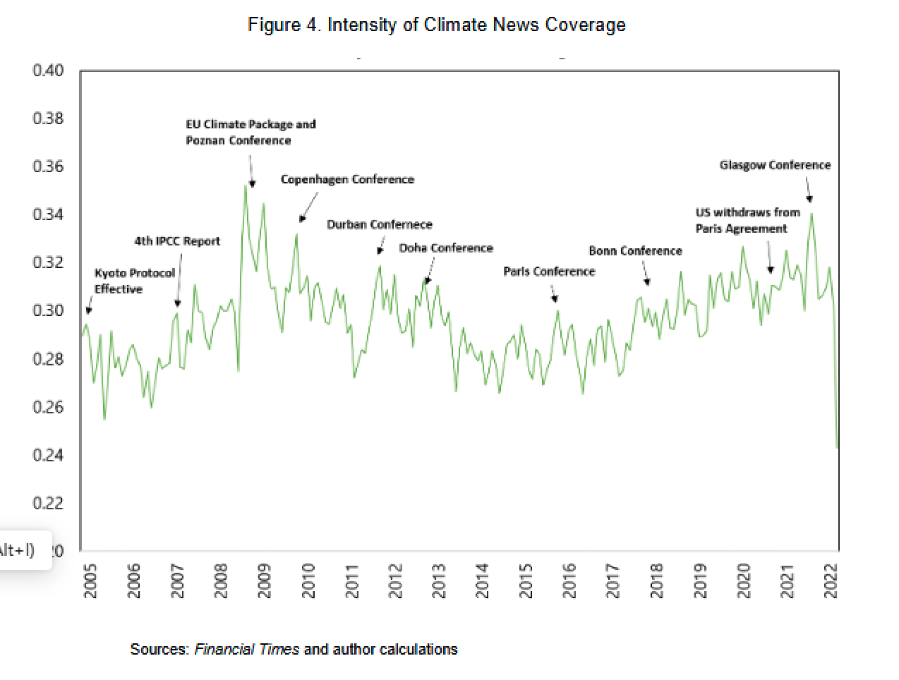
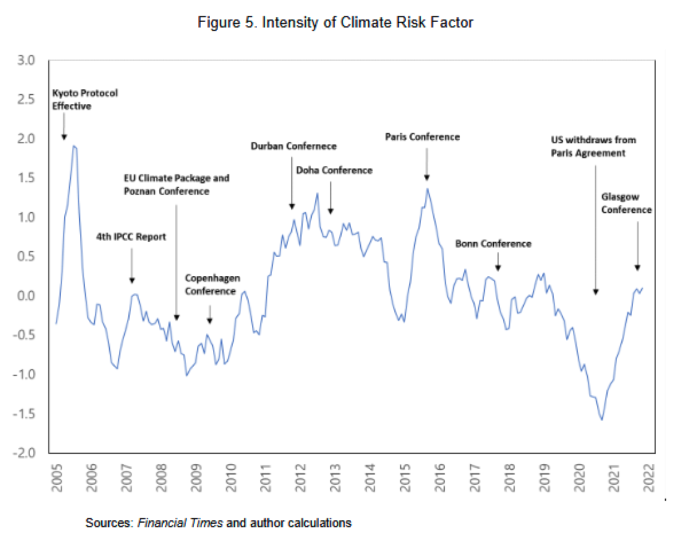

# Decomposing Climate Risks in Stock Markets

[Working Paper • International Monetary Fund](https://www.imf.org/en/Publications/WP/Issues/2023/06/30/Decomposing-Climate-Risks-in-Stock-Markets-534307)

> **TL;DR**  
> This repository contains all code used in **“Decomposing Climate Risks in Stock Markets”**.  
> We train transformer models and leverage cutting-edge LLMs to classify climate-related news, quantify sentiment, and link them to equity-market returns.

---

| Climate-news coverage (1990-2023) | Contribution of climate-risk factors |
|:--:|:--:|
|  |  |

---

## 🚀 Quick start

```bash
# 1. Clone & enter the repo
$ git clone https://github.com/johnsonice/Decomposing_Climate_Risks_in_Stock_Markets.git
$ cd Decomposing_Climate_Risks_in_Stock_Markets

# 2. **Create & activate a Conda environment**
$ conda create -n climate-risk python=3.11 -y
$ conda activate climate-risk

# 3. **Install dependencies** (≈ 2 min)
$ pip install -r requirements.txt   # or see "Dependencies" below if you prefer manual install

# 4. **Add your API keys**
#    Create a `.env` file in the project root (loaded automatically via [python-dotenv]) and populate it as follows:
#
#    ```ini
#    OPENAI_API_KEY=sk-...
#    GOOGLE_API_KEY=...
#    CLAUDE_API_KEY=...
#    ```

# 5. Fine-tune or run inference (examples)
$ python src/Fintuning_climate_news_classification/train.py              # supervised fine-tuning
$ python src/LLM_climate_news_classification/create_batch_task.py        # create LLM tasks
$ python src/LLM_climate_news_classification/async_inference.py --help   # batched async inference
```

---

## 🗂️ Repository structure

```text
.
├── libs/                      # Shared helper utilities for OpenAI, Gemini, Claude, async wrappers
├── notebooks/                # Jupyter notebooks for exploratory analysis & evaluation
├── src/
│   ├── Fintuning_climate_news_classification/   # HuggingFace fine-tuning pipeline
│   └── LLM_climate_news_classification/         # Prompt engineering & LLM inference scripts
└── README.md                 # You are here
```

### Key scripts

| Path | Purpose |
|------|---------|
| `src/Fintuning_climate_news_classification/train.py` | Fine-tune RoBERTa/BERT classifiers on labelled climate news. |
| `src/Fintuning_climate_news_classification/train_HyperParamSearch.py` | Ray-Tune based hyper-parameter search. |
| `src/LLM_climate_news_classification/create_batch_task.py` | Split raw news into JSONL batches suitable for LLM API calls. |
| `src/LLM_climate_news_classification/async_inference.py` | Fully-async, rate-limited LLM inference; supports GPT-4o, Gemini 1.5 & Claude 3. |
| `src/LLM_climate_news_classification/evaluate_results.py` | Compute accuracy/F1 & aggregate costs. |

---

## 🏃‍♀️ Reproducing paper results

1. **Labelled climate-news dataset**  
   Prepare the dataset in HuggingFace format (`dataset_dict['train'|'val'|'test']`).  Sample notebooks show the exact schema.
2. **Supervised fine-tuning**  
   Run `train.py`; best checkpoints are stored in `Models/news_classification/`.
3. **LLM zero-shot / few-shot classification**  
   Use `create_batch_task.py` → `async_inference.py`.
4. **Evaluation & aggregation**  
   Execute `evaluate_results.py` or see `notebooks/eval_*.ipynb`.
---


